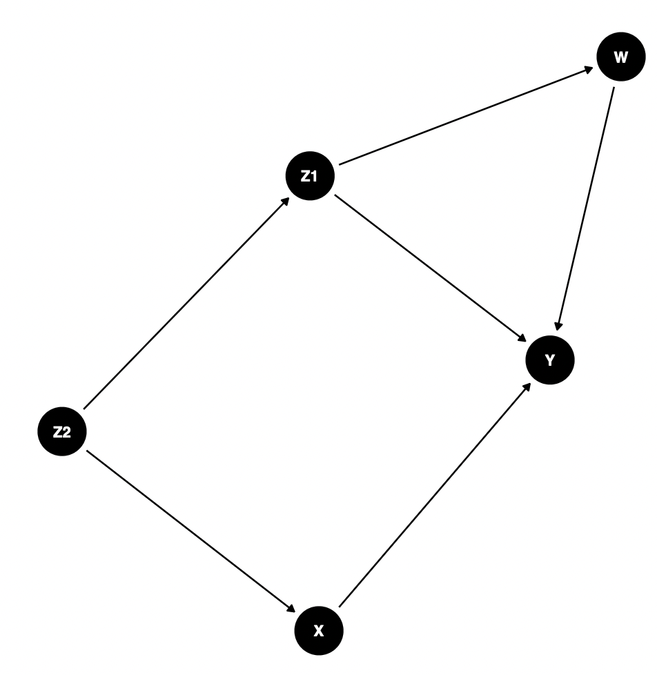
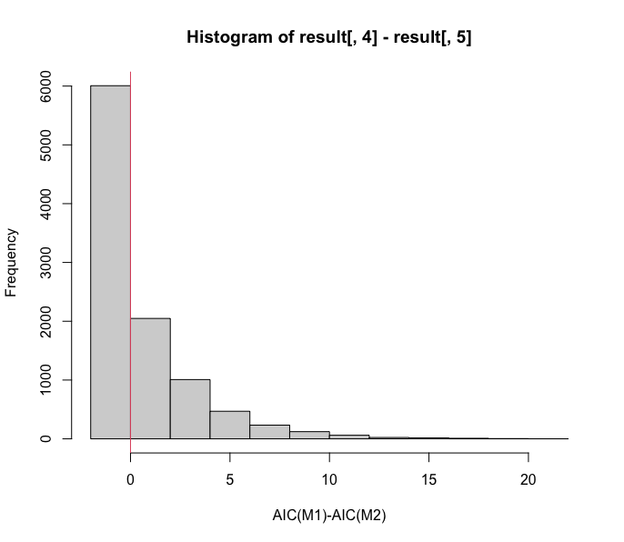
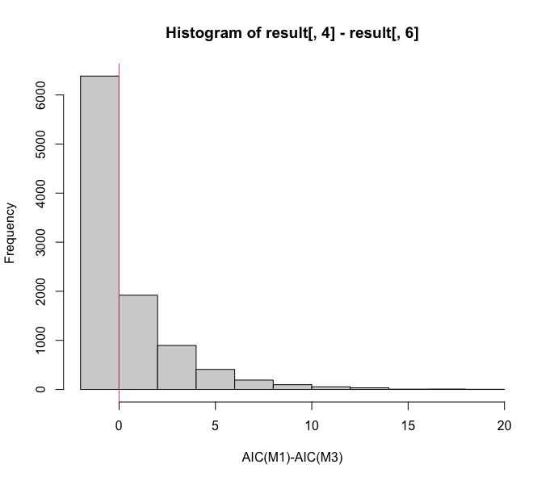
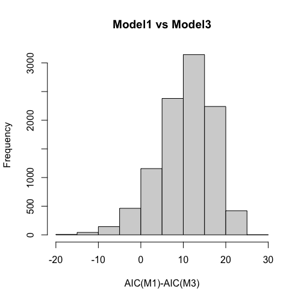
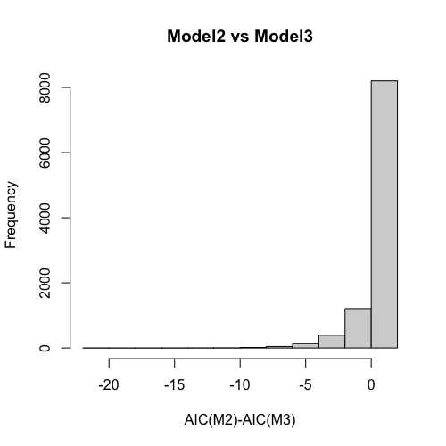

# "生態学と因果推論1"
author: "Ph.D. Ohkubo Yusaku"
date: "2/18/2022"

## はじめに
近頃、生態学でも徐々に統計的因果推論に対する関心が高まっている。しかし、なぜそもそも既存の方法ではいけないのだろうか？生態学では一般化線形モデル(GLM)やその拡張（GLMM）が広く普及し、それらを情報量規準(AICやBIC)等で比較する手順がある種のゴールドスタンダードとして機能してきた。これらの手法はどの説明変数が“効いて”いるのか判断するのにも使われていると思われる（例えば「XXの効果も考慮した方が良いのではないか」といった質問に対しては「その変数を投入したモデルがAICで選ばれなかった」ことが結果の根拠して示される）。情報量規準の重視は生態学に固有の状況かもしれないが、こうした状況がどのような問題を引き起こすのか認識しない限り、わざわざコストをかけて新たな手法を習得するモチベーションは得られないであろう。

そこで本稿では、ごく簡単なシミュレーション実験を通して一般的な情報量規準と統計的因果推論の関係性について例示する。統計的因果推論の理論や具体的な手法についてはすでに多くの良書が世に出ているため、末尾の文献紹介をつけることとしこの記事では取り扱わない。尚、この記事はESJ69の自由集会「フィールドワークと統計モデリング：「現場の勘」の活かしどころ」で発表予定の講演[[W-13-1]](https://www.esj.ne.jp/meeting/abst/69/W13.html)のために大久保が個人的に用意した予備資料を兼ねている。

## 問題設定（1）：バックドア基準
ここでは黒木学(2005)『統計的因果推論』(朝倉書店)の例を参考にする。実世界に5つの変数W、X、Y、Z1、Z2が存在するとしよう。それぞれの変数が、気温だとか、ある生物の個体数だとか、人為的な撹乱の強さだとか、なにか普段の研究であつかう変数だと考えて欲しい。以下では、説明変数Xが目的変数Yに対してどれくらいの影響を与えているか知ることが研究の関心であると仮定する。（「すべての変数に等しく関心があるのではなく、ある興味をもった変数とそれ以外の“邪魔な”変数が混ざっている」という想定は様々な統計的因果推論の手法でミソとなるポイントであり、こうした状況は実際の生態学でもよくあるように思う。）

上記の変数はネットワーク構造を成し（図を参照）、矢印の根本から先に向かって“因果”効果を与えているものとする。具体的には、それぞれの変数がこの以下のような関係に従っている。





Z2 ~ Normal(0, 10)

Z1 ~ 1.2*Z2 + Normal(0,1)

W ~ -0.5*Z1 + Normal(0, 1)

X ~ 0.5*Z2 + Normal(0, 1)

Y ~ 0.1*W – 0.5*X + 0.5*Z1 + Normal(0, 10)

各係数は適当に与えたものなので、適宜変えても構わない。さて、現実の問題では上式のような係数（パラメータ）はわからないので各変数の有限な観測データから推定をしていくことになる。先述のように今回の関心は「X→Y」の部分にあるので、最後の式にあるXの回帰パラメータ0.5の部分を的中させたいということになる。

統計的因果推論の理論によれば、Xについて統計的に妥当(不偏)な推定を行うためには、「目的変数をYとした回帰モデルに、説明変数としてXおよびバックドアバックドア基準を満たす変数を投入するべきだ」と明らかにされている（バックドア基準の詳細は省くが、ここではZ1かZ2のどちらかを投入すればバックドア基準が満たされる）。つまり、AICによってモデル選択を行うのではなく、変数Z1もしくはZ2を強制投入した上でXの回帰係数を推定したり検定すべきである。

では、この指針を無視してAICによるモデル選択を行うとどのような事態が生じるのだろうか。ここで、以下のような三つの回帰モデルを設定してAICを算出してみる。

モデル1： Y ~ X

モデル2： Y ~ X + Z1

モデル3： Y ~ X + Z2

N=100のデータセットで10000回実験すると、モデル1 VS モデル2でもモデル1 VS モデル3でも全体の60％でモデル1が選ばれる。つまりバックドア基準を満たさないモデルであり、推定値にバイアスを伴うモデルが選択される。(さらにいうとポストモデル選択問題もあるが、一旦脇に置く)。
```{r }
N.sim<- 10000
N.sample<- 100

sig.y<- 10

result<- matrix(0, N.sim, 6) 
for (i in 1:N.sim){
　z2<- rnorm(N.sample, 0, 10) # covariate
  z1<- 1.2*z2 + rnorm(N.sample, 0, 1) # covariate
  w<- -0.5*z1 + rnorm(N.sample, 0, 1) 
  x<- 0.5*z2 + rnorm(N.sample, 0, 1) # target variable
  y<- 0.1*w - 0.5*x + 0.5*z1 + rnorm(N.sample, 0, sig.y) # outcome

  # the true "causal effect" is -0.5
  model1<- lm(y ~ x) # a model yielding biased estimate
  model2<- lm(y ~ x +z1) # satisfying backdoor criterion
  model3<- lm(y ~ x +z2) # satisfying backdoor criterion
  
  result[i,1]<- model1$coefficients[2] 
  result[i,2]<- model2$coefficients[2]
  result[i,3]<- model3$coefficients[2]
  
  result[i,4]<- AIC(model1)
  result[i,5]<- AIC(model2)
  result[i,6]<- AIC(model3)
}

# delta_AIC
hist(result[,4] - result[,5], xlab="AIC(M1)-AIC(M2)")
  abline(v=0, col=2)
hist(result[,4] - result[,6], xlab="AIC(M1)-AIC(M3)")
  abline(v=0, col=2)

summary(result[,4] - result[,5])
summary(result[,4] - result[,6])

tmp1<- (result[,4] - result[,5])
tmp2<- (result[,4] - result[,6])

# smaller model is chosen in almost 60% of times
length(tmp1[tmp1<0])
length(tmp2[tmp2<0]) 
```


ここでの実験は意図的に交絡因子がノイズに埋もれてしまうようなパラメータ値を指定しており、またサンプルサイズも小さめに設定されている。これらの条件が結果に大きく影響していることは間違い無い(実際この問題設定では、サンプルサイズを十分に増やすことでAICの主要項である対数尤度に無視できない差を生じさせることができる)のだが、AICと統計的因果推論の着眼点の違いを際立たせるという目的にはよい例になっているのではないかと思う。（なお「AICと異なるBICであれば真のモデルを選ぶことができる」という情報が引用される場合もあるが、BICのほうが付加的なパラメータに対して罰則項が強く設定されているので上記の設定ではむしろ事態を悪化させることに注意してほしい）。

## 問題設定（2）：傾向スコアによる処置効果推定
ここまで、統制すべき交絡因子の選択にバックドア基準を用いる統計的因果推論の手法について検討してきた。しかしながら、実際のデータ解析の場面で必ずしもこの方法が最適な選択肢になるとは限らない。例えばバックドア基準に基づいてモデルに投入する変数を選択する際には、主眼となる目的変数に対してどの変数がどのような関係性を有しているかを背景知識に基づいて判断する必要がある。ところが実際のデータ解析では、背景知識の欠落などにより投入すべき変数を適切に選べないことがあるかもしれない。

因果効果を評価したい変数Xが離散的な場合、このような状況でも傾向スコアと呼ばれる指標を活用することにより比較的ゆるい条件で因果効果の推定ができる場合があると知られている。以下のシミュレーションでは、因果効果の不偏一致推定量が得られる二つの方法と、推定量にバイアスを生じる方法をAICの観点から比較する。(傾向スコア解析では説明変数として投入する方法よりも各標本の重み付けに使用する方法の方が適切であるという指摘もあるが、ここではナイーブなAICを適用できる条件で比較するために比較から除外した)。

２値の変数X（たとえばある処置を受けたか受けなかったか）が目的変数Yに一定の“因果”効果を与えていると考える。ただし、XとYには交絡因子Zが存在し、Xが処置群に割り当てられる確率に影響を与えつつYに線形な影響を与えていることが疑われているとしよう。候補となる交絡因子の数は比較的大きい（14次元）ものの、実際に実際にXとY双方に影響している因子の数は全体の一部（5次元）である。

このとき不偏一致推定量を得られる方法として以下のもの二つを考える

モデル1. 回帰モデルに全ての候補共変量を投入する方法
モデル2. 回帰モデルに傾向スコアを説明変数として投入する方法

加えて、バイアスの生じる方法として下記を考える
モデル3. 回帰モデルにXだけを投入する方法

(参考：モデル4. 不偏一致推定量の得られるIPW推定)

適当に真の係数を与えてN＝200のデータセットで10000回試行したのが以下のコードである。


```{r }
library(MASS)

N_sim<- 10000
N<- 200
D<- 2

prop<- c(0.5, 0.5, -0.5, 0.1, -0.1, -0.1, 0.0, 0.0, -0.1, 0.1, -0.1, 0.1, 0.1, -0.1)
#beta_Z<- c(0.2, -0.05, 0.5, -0.5, 0.5, -0.5, 0.5, -0.5, 0, 0, -1, 1, -1, 1)
beta_Z<- c(1, -1, 1, -1, 1, -0, 0, -0, 0, 0, -0, 0, -0, 0)/100
p<- length(prop)

beta_X<- 1.5
intercept_Y<- -2
sigma_Y<- 1

Z <- as.matrix(array(dim=c(N,p)))
  for(i in 1:p){
    Z[,i] <- rnorm(N, 0, 5)
  }
  
prop_t<- plogis(Z %*% prop) 

result <- t(sapply(1:N_sim, function(seed) {
  X<- rbinom(N, size=1, prob=prop_t)
  Y<- beta_X*X + Z %*% beta_Z + rnorm(N, intercept_Y, sigma_Y)
  prop_est<- glm(X ~ Z, family=binomial)$fitted.values
  
  ### full model
  model1<- lm(Y ~ X + Z)
  
  ### Covariate adjusting model
  model2<- lm(Y ~ X + prop_est)
  
  ### biased models
  model3<- lm(Y ~ X)
  
  ### IPW estimator ###
  weight1<- X/prop_est + (1-X)/(1-prop_est)
  model4<- lm(Y ~ X, weights = weight1)
  
  x_1<- model1$coefficients[2]
  x_2<- model2$coefficients[2]
  x_3<- model3$coefficients[2]
  x_4<- model4$coefficients[2]
  
  aic1<- AIC(model1)
  aic2<- AIC(model2)
  aic3<- AIC(model3)
  
  c(x_1=x_1, x_2=x_2, x_3=x_3, x_4=x_4, max_prop=max(weight1),
    aic1=aic1, aic2=aic2, aic3=aic3)
}))

result<- as.data.frame(result)
summary(result)

tmp1<- result$aic1-result$aic3
length(tmp1[tmp1>0])
hist(tmp1, xlab="AIC(M1)-AIC(M3)", main="Model1 vs Model3")

tmp1<- result$aic2-result$aic3
length(tmp1[tmp1>0])
hist(tmp1, xlab="AIC(M2)-AIC(M3)", main="Model2 vs Model3")
```


理論から期待される通り、モデル1、モデル2、モデル4の推定値は真の係数を不偏に推定することができる。しかし、多くの共変量が存在しそれらが弱くyに対して効果をもたらしている場合にAICを使うと80-90%の高い確率でモデル3が選ばれることがわかる。

ただし条件を変えて実験するとより込み入った事情も見えてくる。第一に、AICが不適切なモデル3を選ぶ確率は共変量からyへの効果が弱くなればなるほど高くなる一方で、因果効果の定量的評価という観点からは交絡の影響が減少する分モデル3のバイアスは減少する。第二に、より単純なモデル3を使うことで推定の分散を減らすことができる。実際RMSEで評価するとモデル3が最良となるケースも十分に生じうる。逆にIPWは不偏な推定が可能であるものの、標本に逆確率を使った重みを与えるためモデル1,2やバイアスのあるモデル3と比べて推定量の分散が大きくなり、RMSEが大きくなる。ただし今回は交絡因子とyが線形な関係を持つ様子をシミュレートしており、セミパラメトリックな状況で適用できるIPWの強みが十分に発揮できていないという点には注意が必要であろう。さらにモデル誤特定時の挙動を考慮することも、複雑な事象を扱う生態学では重要な意味を持つだろう(たとえば二重頑健推定)。

## 暫定まとめ
というわけで、教科書的に言えば因果効果の推定にナイーブなAICに基づくモデル選択を適用すると「不偏推定」という意味での理論的な妥当性が得られない。しかし、単に「AICはやめてIPWなどを使うべきだ」と結論づけるのは早急であろう。統計的因果推論は因果効果の不偏な推定という異なる対象を評価しているわけだが、「分散の意味で効率的な推定を選ぶ」のか「とにかく不偏性にこだわるべきか」はたまた「多少モデル構造を間違って指定してもそれなりにうまくいく方法がよい」のか、これは_生態学という領域が抱える学術的問いを明確化する中で答えていくべき“価値選択”の問題であり、単に統計手法の技術的な問いを専門家に投げかけるだけでは解決不可能な問題であるように思われる。さらにここ数年は、Focused Information Criterionの適用など統計的因果推論の場面でも推定のバイアスとバリアンスをうまく両立させる試みも現れ始めている。では、現実の野外生物データと向き合う中で“先端的”な統計手法や、柔軟な統計モデリングを取り入れることにはどのような価値があるのだろうか。こうして、この自由集会の企画趣旨へと辿り着くことになる。

__なお実際に傾向スコアを用いた解析を行うには共変量のバランシングなど考慮すべき事項があり本稿で紹介した手法を機械的に適用することは決して推奨されない。__

## 参考文献
岩崎学(2015)『統計的因果推論』(朝倉書店)
-生態学の基準から見ると、やや数理統計寄りである

黒木学(2004)『統計的因果推論-回帰分析の新しい枠組み』(朝倉書店)

高橋将宜(2022)『統計的因果推論の理論と実装』(共立出版)
-Rコードが豊富で大変わかりやすいという評判のようだ

松王政浩(2020)『科学哲学からのメッセージ:因果・実在・価値をめぐる科学との接点』(森北出版)
-ヒュームからPearlにまで至る因果概念をめぐる定義とその歴史が、著者独自の視点で整理されている。
